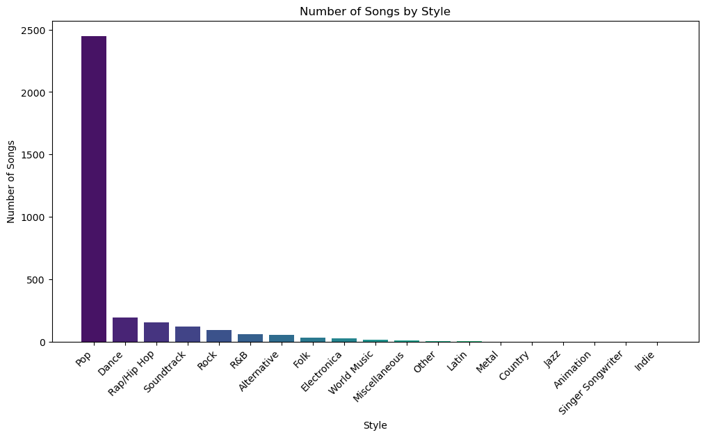
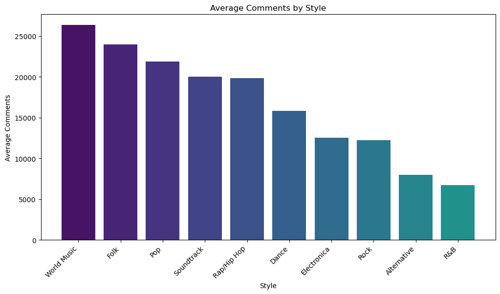
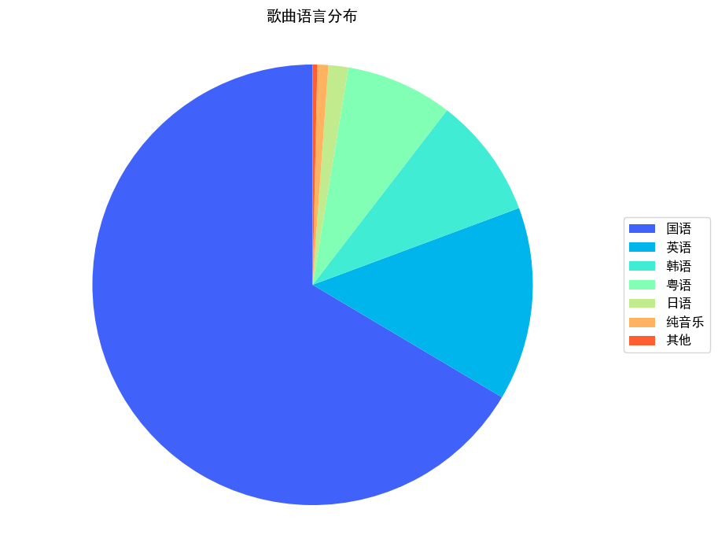
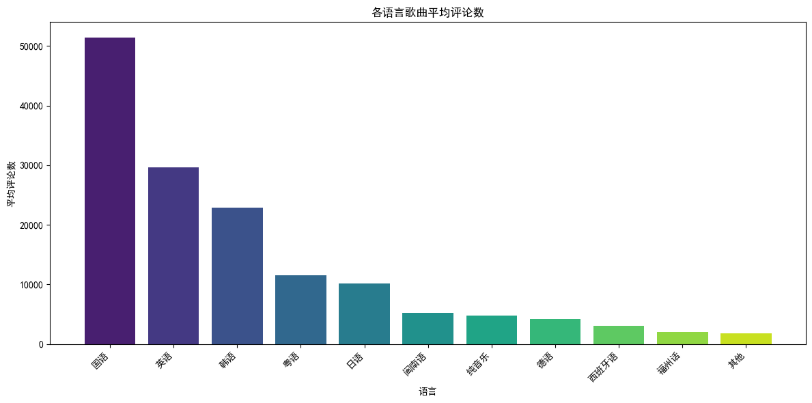
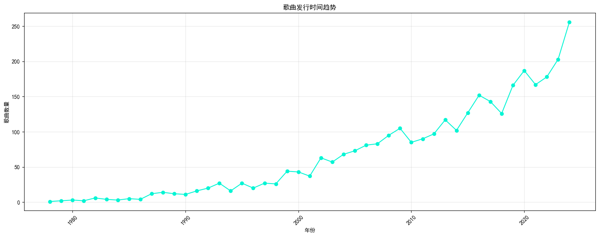
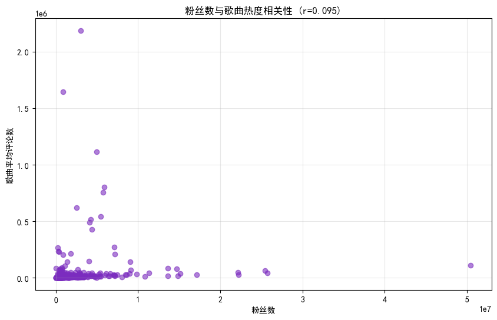
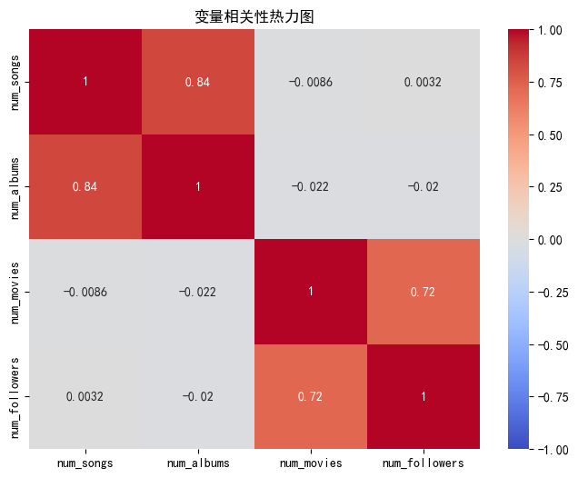
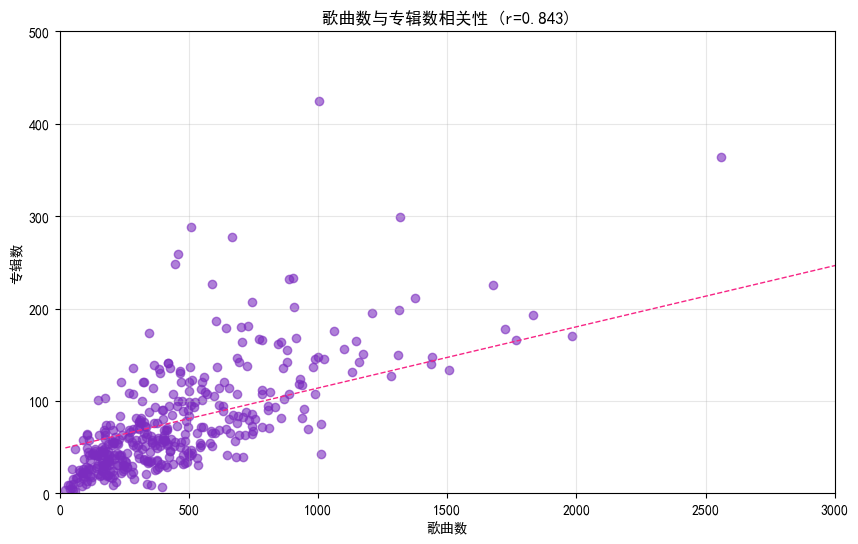
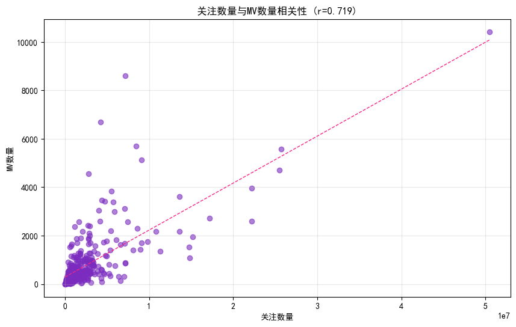

# QQ音乐中部分歌手与歌曲数据分析报告

*2025010563 葛沐昊*

---

## 数据概览

本报告基于从QQ音乐平台爬取的歌曲与歌手数据进行分析，共包含 **400 位歌手** 和 **3848 首歌曲** 的信息。
详细代码可见 `analyze.ipynb` 文件。

**歌手数据属性：** 
```
name
intro
mid
num_songs
num_albums
num_movies
num_followers
popular_songs
similar_singers
```

**歌曲数据属性：** 
```
name
mid
singer
singer_mid
intro
album
language
style
release_date
lyrics
num_comments
```

> **注意：** 由于爬取的数据并非QQ音乐平台的全量数据，以下所有结论仅对本报告所爬取的部分数据负责，特此说明。

---

## 一、歌曲内容特征分析

本模块从歌曲的 `style`（流派）和 `language`（语言）两个维度出发，分析数据集中歌曲的内容构成特征，探究不同音乐类型的数量分布与用户讨论热度差异。

### 1.1 流派分布

**分析依据：** 歌曲的 `style` 字段，以及 `num_comments`（评论数）字段。

**分析逻辑：** 对 `style` 字段进行归类统计，计算每种流派包含的歌曲数量。在此基础上，筛选歌曲数量超过10首的流派，计算每类歌曲的平均评论数，以衡量不同流派用户的讨论活跃度。

**图1：各流派歌曲数量分布**



从柱状图可以看出，**Pop（流行）风格歌曲数量远超其他流派**，在3848首歌曲中占据绝对主导地位。其次是 Dance（舞曲）和 Rap/Hip Hop（说唱/嘻哈）。这反映出在QQ音乐平台上，流行音乐是最为主流且产量最大的音乐类型，符合大众音乐消费的基本规律。

**图2：各流派平均评论数**



从平均评论数来看，**World Music（世界音乐）的平均评论数最高**，其次是 Folk（民谣）和 Pop（流行）。World Music 虽然歌曲数量不多，但听众对其讨论热情极高，可能是因为这类音乐文化内涵丰富，容易引发深度讨论和共鸣。Folk（民谣）也因其叙事性强、贴近生活而获得较高的评论互动。

> **结论：** 数据集中 Pop 风格歌曲数量占比具有压倒性优势，但在评论互动方面，World Music、Folk 和 Pop 三类音乐的平均评论数位居前三。这说明小众风格的音乐虽然产量不高，但具有更强的用户黏性和讨论深度。

### 1.2 语言分布

**分析依据：** 歌曲的 `language` 字段，以及 `num_comments`（评论数）字段。

**分析逻辑：** 对 `language` 字段进行归类统计，计算每种语言对应的歌曲数量，并通过饼图展示数据集中歌曲的语言构成比例。在此基础上，计算每类歌曲的平均评论数，以衡量不同语言歌曲的讨论活跃度。

**图3：歌曲语言分布**



从饼图可以看出，数据集中歌曲的语言分布如下：

| 语言 | 歌曲数量 | 占比 |
|------|---------|------|
| 国语 | 2558 | 66.5% |
| 英语 | 546 | 14.2% |
| 韩语 | 342 | 8.9% |
| 粤语 | 302 | 7.8% |
| 日语 | 56 | 1.5% |
| 纯音乐 | 31 | 0.8% |
| 其他 | 较少 | <1% |

**国语歌曲以2558首的数量占据绝对主导地位**，超过总数据量的一半（约66.5%）。英语歌曲以546首位居第二，韩语和粤语也占据一定比例，三者合计占比超过30%。这一分布特征与QQ音乐作为国内主流音乐平台的定位高度一致：平台核心用户群体为中文用户，国语歌曲是内容库的绝对主力，同时兼顾韩语、英语等国际化内容以满足不同用户的听歌偏好。

> **结论：** 数据集中歌曲以国语为主（2558首，占比66.5%），其次为英语（546首，14.2%）、韩语（342首，8.9%）和粤语（302首，7.8%）。语言分布反映了国内音乐平台以中文歌曲为核心、兼顾国际化内容的特征，也侧面体现了韩流文化在国内音乐市场的影响力。

### 1.2.2 各语言歌曲平均评论数分析

**图4：各语言歌曲平均评论数分布**



| 语言 | 歌曲数量 | 平均评论数 |
|------|---------|-----------|
| 国语 | 2558 | 51440.4 |
| 英语 | 546 | 29592.7 |
| 韩语 | 342 | 22906.6 |
| 粤语 | 302 | 11522.4 |
| 日语 | 56 | 10189.4 |
| 纯音乐 | 31 | 4820.5 |
| 其他 | 较少 | 1000-5200 |

从平均评论数来看，**国语歌曲以51440.4的平均评论数遥遥领先**，远超其他语言的歌曲。英语歌曲以29592.7的平均评论数位居第二，韩语以22906.6紧随其后。粤语歌曲虽然数量较多（302首），但平均评论数为11522.4，约为国语歌曲的1/4~1/5。

这一分布呈现出以下规律：

- **国语歌曲在数量和评论热度上均占据绝对优势**，体现了QQ音乐用户以中文母语用户为主的特征，用户对国语歌曲的讨论意愿最强。
- **英语歌曲平均评论数位居第二**，说明国际化的英文歌曲在国内也有较高的讨论热度，用户群体存在一定的跨文化音乐消费需求。
- **韩语歌曲平均评论数较高**（22906.6），结合其342首的数量，反映出韩流文化在国内音乐市场具有较强的影响力，K-pop粉丝群体活跃度高。
- **粤语歌曲呈现“数量多但评论少”的特征**，302首歌曲体量可观，但平均评论仅为11522.4，可能因为粤语歌曲受众相对固定但规模有限，或者粤语歌曲更多作为背景音乐消费而非引发深度讨论。

> **结论：** 国语歌曲在数量和评论热度上均占据绝对优势，平均评论数（51440.4）远超其他语言。英语和韩语歌曲的平均评论数位居第二、第三，反映出国际化内容和韩流文化在国内市场具有较强的用户讨论度。粤语歌曲虽然数量较多，但平均评论数偏低，呈现“量大但讨论度不高”的特征。

---

## 二、歌曲发行时间趋势分析

**分析依据：** 歌曲的 `release_date`（发行日期）字段。

**分析逻辑：** 提取 `release_date` 字段中的年份信息，按年份统计歌曲数量，绘制时间序列折线图，观察歌曲发行数量随时间的变化趋势，分析数据集中歌曲的时间分布特征。

**图5：歌曲发行时间趋势**



从折线图可以清晰看到：

- 数据集中歌曲主要集中在 **2000年之后**，2000年之前的歌曲数量极少，这与QQ音乐平台作为数字音乐平台的内容收录策略有关。平台更倾向于收录数字音乐时代以来的作品。
- 2005年至2014年间，歌曲数量在70-120首之间波动，增长相对平缓，整体呈缓慢上升态势。
- 从 **2015年开始**，歌曲数量增速明显加快，2015年仅127首，到2024年已达到256首，十年间几乎翻倍。
- 2019年之后，每年歌曲数量均保持在160首以上，整体处于高位运行状态。

> **结论：** 数据集中歌曲发行数量呈逐年上升趋势，2015年之后增速明显加快。这反映出近年来音乐产业数字化转型加速、音乐人创作门槛降低，以及QQ音乐平台内容库持续扩充的趋势。值得注意的是，2020-2021年数据并未因疫情出现明显下滑，说明数字音乐平台具有较强的抗风险能力。

---

## 三、歌手热度与产出关联分析

本模块从歌手的热度指标（粉丝数）与产出指标（歌曲数、专辑数、MV数）两个维度，分析歌手热度与歌曲热度、以及歌手产出指标之间的内在关联。

### 3.1 歌手热度与歌曲热度关联

**分析依据：** 歌手的 `num_followers`（粉丝数）字段，以及歌曲的 `num_comments`（评论数）字段。

**分析逻辑：** 提取每位歌手的粉丝数及其热门歌曲的平均评论数，绘制散点图并计算皮尔逊相关系数，分析歌手热度（粉丝数）与歌曲热度（评论数）之间的关联性。

**图6：粉丝数与歌曲热度相关性散点图**



散点图中每个点代表一位歌手，横轴为粉丝数，纵轴为该歌手热门歌曲的平均评论数。通过计算，粉丝数与歌曲平均评论数之间的皮尔逊相关系数 **r ≈ 0.095**，接近于零，说明**两者之间几乎没有线性相关性**。

这意味着：

- 粉丝数高的歌手，其歌曲评论数不一定高——可能出现"人红歌不红"的现象；
- 歌曲评论数高的歌手，其粉丝数也不一定高——可能出现"歌红人不红"的现象。

> **结论：** 歌曲评论数与歌手粉丝数之间不存在显著相关性（r ≈ 0.095）。这说明在QQ音乐平台上，"人红"和"歌红"未必同步——用户对歌曲的评论热度更多取决于歌曲本身的质量、传播度与话题性，而非单纯依赖歌手的知名度。

### 3.2 歌手产出指标关联

**分析依据：** 歌手的 `num_songs`（歌曲数）、`num_albums`（专辑数）、`num_movies`（MV数）、`num_followers`（粉丝数）四个字段。

**分析逻辑：** 提取每位歌手的四个产出与热度指标，构建相关系数矩阵，通过热力图直观展示各变量之间的相关性强度。然后对相关性最强的两对变量（歌曲数与专辑数、粉丝数与MV数）分别绘制散点图并添加线性拟合线，进一步验证相关关系。

**图7：变量相关性热力图**



从热力图可以直观看出四组变量之间的相关性强度：

- **歌曲数与专辑数之间相关系数 r ≈ 0.84**，呈现显著强正相关。
- **粉丝数与MV数之间相关系数 r ≈ 0.72**，也呈现显著强正相关。
- 其余四组变量之间（如歌曲数与粉丝数、专辑数与MV数等）相关系数较低，不存在显著相关性。

**图8：歌曲数与专辑数相关性散点图**



散点图中，每个点代表一位歌手，横轴为歌曲数，纵轴为专辑数。粉色虚线为线性拟合线。数据点沿拟合线分布，验证了两者之间的强正相关关系。这是因为歌手通常以专辑形式发布音乐，一张专辑包含多首歌曲，因此发行的专辑越多，累积歌曲数量也越多，符合音乐产业的基本发行规律。

**图9：粉丝数与MV数量相关性散点图**



散点图中，横轴为粉丝数，纵轴为MV数量。数据点同样呈现沿拟合线的正向分布趋势。这说明粉丝关注度越高的歌手，往往会制作更多的MV来满足粉丝需求、扩大影响力，形成"高关注 → 高产出 → 更高关注"的良性循环。

> **结论：** 
> 1. 歌手歌曲数量与专辑数量之间存在显著正相关（r ≈ 0.84），合理反映了歌手以专辑形式发布歌曲的行业规律。
> 2. 歌手粉丝数与MV数量之间存在显著正相关（r ≈ 0.72），说明高关注度歌手倾向于制作更多MV作品。
> 3. 其余四组变量之间不存在显著相关性，说明歌手的粉丝数量与歌曲/专辑产量之间没有必然的线性关联，粉丝数高的歌手不一定高产，高产歌手也不一定粉丝数高。

---

## 总结

本报告基于QQ音乐平台上400位歌手和3848首歌曲的爬取数据，从歌曲内容特征、发行时间趋势、歌手热度与产出关联三大维度进行了数据分析，共涉及5个子分析模块，得出以下核心结论：

| 维度 | 分析模块 | 核心结论 | 关键数据支撑 |
|------|---------|---------|-------------|
| 歌曲内容特征 | 流派分布 | Pop风格数量占绝对优势，但World Music、Folk、Pop平均评论数最高 | Pop歌曲数量远超其他流派；World Music平均评论数居首 |
| 歌曲内容特征 | 语言分布 | 国语歌曲数量超半数（66.5%）且平均评论数最高，英语、韩语均分列二三位 | 国语2558首（51440.4），英语546首（29592.7），韩语342首（22906.6），粤语302首（11522.4） |
| 发行时间趋势 | 年份分布 | 歌曲发行数量逐年上升，2015年后增速明显加快 | 2005年73首 → 2024年256首，近20年持续增长 |
| 热度与产出关联 | 热度相关性 | 歌手粉丝数与歌曲评论数无显著相关性，"人红"与"歌红"未必同步 | r≈0.095 |
| 热度与产出关联 | 产出指标关联 | 歌曲数与专辑数正相关，粉丝数与MV数正相关，其余四组变量相关性不显著 | r≈0.84，r≈0.72 |

> 以上结论仅对本次爬取的部分数据负责，不构成对QQ音乐平台全量数据的推断。