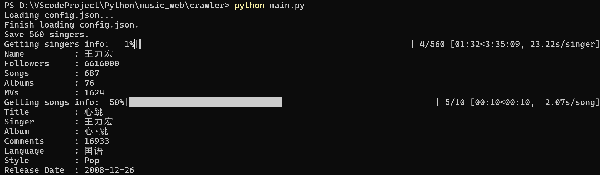
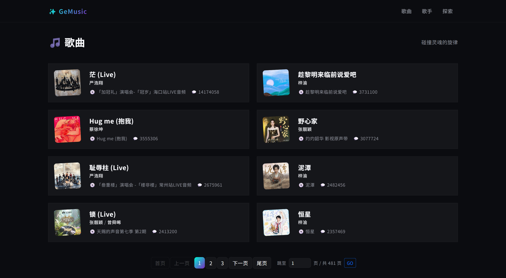
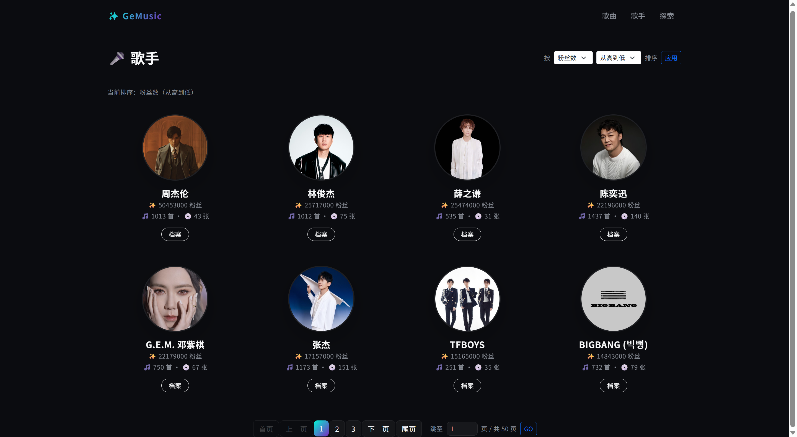
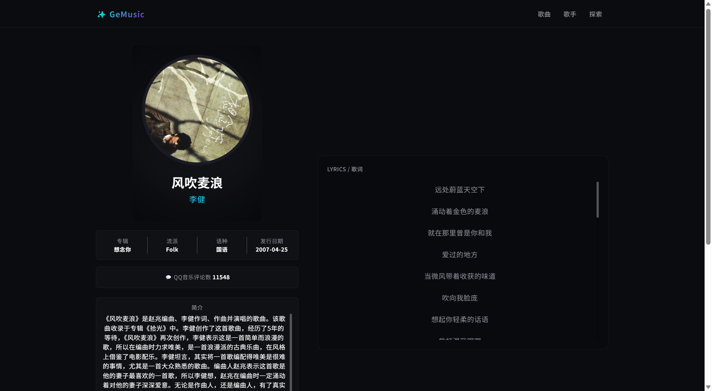
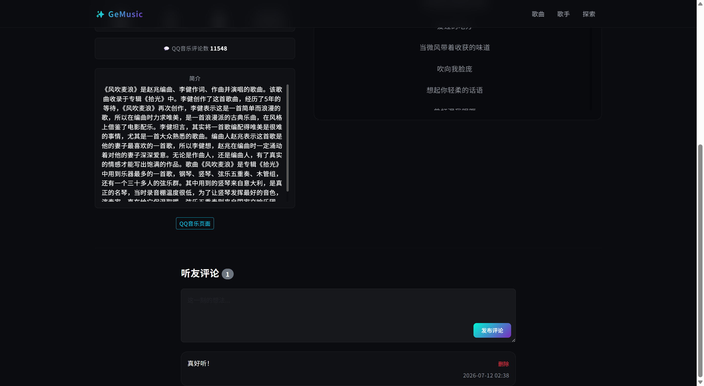
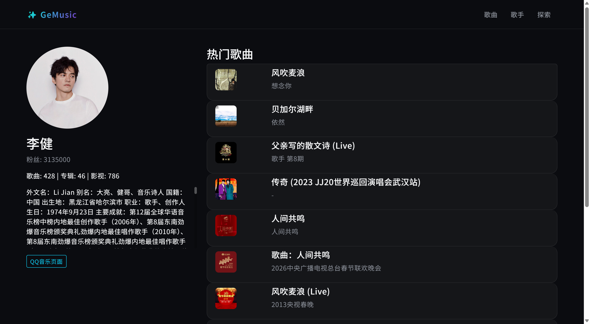
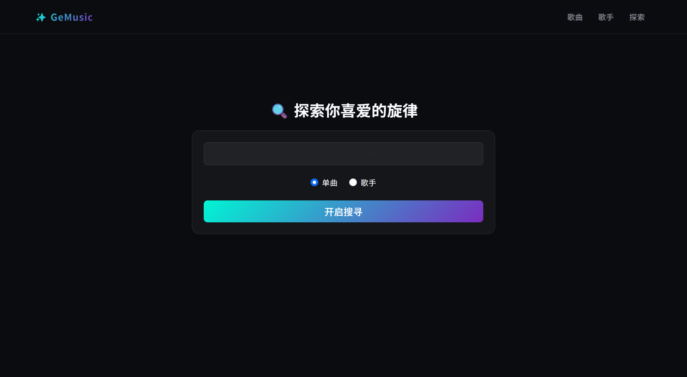
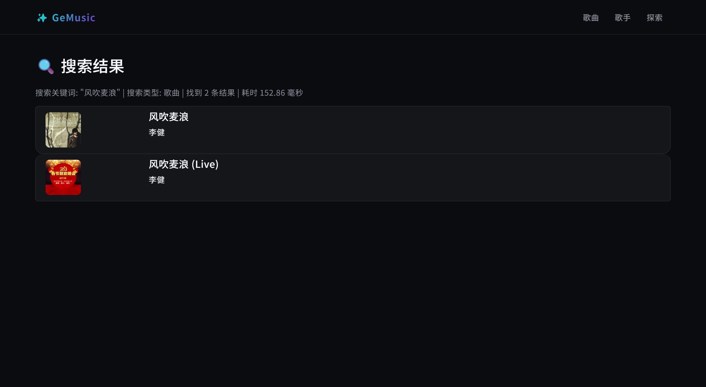

# 爬虫与信息系统

*葛沐昊 2025010563*

---

## 概述

本项目基于 Playwright 爬虫 + Django 的音乐数据展示网站 + 数据分析，爬取 QQ 音乐相关信息。

```
music_web/
├── crawler/ # 爬虫模块
│   ├── main.py # 主程序入口
│   ├── robot.py
│   ├── get_singers.py
│   ├── get_songs.py
│   ├── config.json # 登录配置不提交到 Git
│   ├── UA_list.json
│   └── data/ # 爬虫原始数据不提交到 Git
├── GeMusic_site/ # 网站模块
│   ├── manage.py
│   ├── db.sqlite3 # 数据库文件不提交到 Git
│   ├── GeMusic/
│   │   ├── models.py
│   │   ├── views.py
│   │   ├── urls.py
│   │   ├── admin.py
│   │   ├── migrations/
│   │   ├── static/ # 静态资源图片不提交到 Git
│   │   └── templates/
│   └── GeMusic_site/
│       ├── settings.py
│       ├── secret_key.txt # SECRET_KEY 不提交到 Git
│       └── urls.py
├── report/ # 报告模块
│   ├── analyze_report/ # 数据分析报告
│   └── project_report/ # 项目报告
├── import_data.py # 数据迁移脚本
├── analyze.ipynb # 数据分析
├── .gitignore
└── README.md
```

---

## 爬虫功能与设计
### 设计
1. 在浏览器界面打开QQ音乐登录，脚本自动保存登录配置到 `config.json` 文件中。
2. 程序根据 `config.json` 文件中的登录配置，自动登录QQ音乐。进入歌手列表页面，爬取歌手信息（mid编号、姓名）。
3. 程序根据各歌手mid，依次进入歌手详情界面爬取详情信息，根据其展示的歌曲列表，异步爬取歌曲信息。
- 主程序 `main.py` 负责协调各模块的运行
- 爬虫模块 `robot.py` Playwright 异步浏览器自动化爬虫的基本操作
- 解析模块 `get_singers.py`、`get_songs.py` BeautifulSoup 解析器负责解析网页内容，提取所需信息

**运行展示**


### 数据量
- **singers: 400**
    - name
    - intro
    - mid
    - num_songs
    - num_albums
    - num_movies
    - num_followers
    - popular_songs
    - similar_singers
- **songs: 3848**
    - name
    - mid
    - singer
    - singer_mid
    - intro
    - album
    - language
    - style
    - release_date
    - lyrics
    - num_comments

---

## 信息系统功能与设计

### 设计

本信息系统基于 **Django 6.0** Web框架构建，采用标准的 **MTV（Model-Template-View）** 架构模式，实现了从爬虫数据到网页展示的完整流转。系统整体设计思路如下：

1. **数据层**：在 `models.py` 中定义 `Singer`（歌手）、`Song`（歌曲）、`SingerSong`（歌手-歌曲关联）与 `Comment`（用户评论）四个数据模型，使用 Django ORM 自动管理 SQLite 数据库表结构与关联关系
2. **业务层**：在 `views.py` 中实现各页面的业务逻辑，包括分页查询、排序筛选、多条件搜索、评论增删等功能
3. **表现层**：在 `templates/` 目录下使用 Django 模板引擎构建 7 个页面模板，基于 `base.html` 统一继承，通过 Bootstrap 5 与自定义 CSS 实现现代化深色主题 UI
4. **迁移脚本**：`import_data.py` 负责将爬虫爬取的 JSON 数据与图片资源批量导入 Django 数据库和静态资源目录

**主要技术栈**：

| 技术/组件 | 用途 |
|-----------|------|
| Django 6.0 | Web 框架，提供 ORM、模板引擎、路由系统 |
| SQLite | 轻量级数据库，存储歌手、歌曲与用户评论 |
| Bootstrap 5 | UI 组件库，提供基础样式与响应式布局 |
| Django ORM | 对象关系映射，通过 Python 代码操作数据库 |
| Paginator | Django 内置分页器，处理大量数据分页展示 |
| Q 查询 | Django 复合查询对象，实现多条件搜索 |
| shutil | Python 标准库，处理图片资源的复制迁移 |

### 数据库设计

系统包含 4 个核心数据模型，定义在 `GeMusic/models.py` 中：

**Singer（歌手表）**

| 字段 | 类型 | 说明 |
|------|------|------|
| mid | CharField (PK) | QQ音乐歌手编号，主键 |
| name | CharField | 歌手姓名 |
| intro | TextField | 歌手简介 |
| num_songs | IntegerField | 歌曲数量 |
| num_albums | IntegerField | 专辑数量 |
| num_movies | IntegerField | MV 数量 |
| num_followers | BigIntegerField | 粉丝数 |

**Song（歌曲表）**

| 字段 | 类型 | 说明 |
|------|------|------|
| mid | CharField (PK) | QQ音乐歌曲编号，主键 |
| name | CharField | 歌曲名 |
| intro | TextField | 歌曲简介 |
| album | CharField | 所属专辑 |
| language | CharField | 语种 |
| style | CharField | 流派（Pop/Rock/Folk 等） |
| release_date | DateField | 发行日期 |
| lyrics | TextField | 歌词 |
| num_comments | IntegerField | QQ音乐评论数 |
| singers | ManyToManyField | 多对多关联歌手 |

**SingerSong（歌手-歌曲关联表）**

用于支持一首歌多位歌手（合唱）的场景，作为 `Singer` 和 `Song` 多对多关系的中间表。

**Comment（评论表）**

| 字段 | 类型 | 说明 |
|------|------|------|
| song | ForeignKey | 外键关联歌曲 |
| content | TextField | 评论内容 |
| created_at | DateTimeField | 创建时间（自动添加） |

数据从爬虫 JSON 文件导入数据库的流程由 `import_data.py` 负责，共分四步：先导入歌手信息，再导入歌曲信息并建立歌手-歌曲关联，最后分别导入歌手头像与歌曲封面图片。`tqdm` 进度条直观展示数据迁移进度。

---

### 歌曲列表页（主页）

**功能说明**：系统主页（`/`）即歌曲列表页，以卡片形式展示所有歌曲，支持分页浏览。

**设计要点**：

1. **查询逻辑**（`views.py - index` 函数）：使用 `Song.objects.all().order_by('-num_comments')` 按评论数降序排序，将最热门的歌曲展示在前面，通过 Django 内置 `Paginator` 分页器每页展示 8 首歌曲
2. **分页交互**：支持"首页/上一页/页码/下一页/尾页"的完整分页导航，并提供"跳至指定页"输入框（统一通过 `page` 参数传递），方便用户快速跳转，页码超出合法范围时自动回退
3. **卡片样式**：采用左右布局的卡片设计，左侧为歌曲封面图片（带轻微倾斜装饰），右侧展示歌曲名、歌手、专辑、评论数信息，整张卡片可点击跳转至详情页
4. **视觉设计**：图片采用圆角+微旋转增强活力，悬停时卡片有向上位移 + 绿色发光边框的过渡动画，整体符合深色毛玻璃主题

**歌曲列表页展示**


---

### 歌手列表页

**功能说明**：歌手列表页（`/singers/`）以网格卡片形式展示歌手，支持按多字段排序与分页浏览。

**设计要点**：

1. **排序逻辑**（`views.py - singer_list` 函数）：支持按粉丝数（num_followers）、歌曲数（num_songs）、专辑数（num_albums）、歌手名（name）四个字段排序，每种字段又可选择"从高到低"或"从低到高"两个方向。通过 `valid_fields` 白名单机制校验排序字段，防止用户构造恶意 URL 进行 SQL 注入攻击
2. **视觉设计**：采用圆形头像 + 渐变标签 + 卡片悬停效果的设计，每位歌手以头像为视觉中心，下方展示核心数据指标（粉丝数、歌曲数、专辑数），底部提供"档案"按钮跳转至详情页
3. **分页设计**：使用 Paginator 分页，分页链接包含排序参数（`sort` 与 `dir`），确保翻页时排序条件不丢失，"跳至指定页"输入框同样统一使用 `page` 参数

**歌手列表页展示**


---

### 歌曲详情页

**功能说明**：歌曲详情页（`/song/<mid>/`）展示歌曲的完整信息，包含封面、歌词、介绍等信息，并提供用户评论功能。

**设计要点**：

1. **信息展示**（`views.py - song_detail` 函数）：左侧展示圆形封面（带缓慢旋转动画）、歌曲名、歌手列表（可跳转至对应歌手详情），以及专辑、流派、语种、发行日期、QQ音乐评论数等核心数据
2. **歌词渲染**：歌词数据以 JSON 数组格式存储于数据库中，查询后在模板中逐行渲染为居中展示的歌词文本，悬停时变为绿色强化与用户的交互感
3. **评论功能**：歌曲详情页下方支持用户匿名评论与删除评论，POST 提交后通过 302 重定向回详情页，防止表单重复提交
4. **视觉设计**：采用径向渐变背景营造氛围，歌词区与评论区使用半透明卡片

**歌曲详情页展示**



---

### 歌手详情页

**功能说明**：歌手详情页（`/singer/<mid>/`）展示歌手档案与热门歌曲列表。

**设计要点**：

1. **信息展示**（`views.py - singer_detail` 函数）：左侧展示歌手头像（圆形）、姓名、粉丝数、歌曲数、专辑数、MV数，以及可滚动的歌手简介。底部提供外链至 QQ 音乐原页面
2. **关联数据**：通过 `singer.songs.all()` 获取该歌手的热门歌曲列表，利用 Django ORM 的多对多关联查询能力，自动处理合唱歌曲的双向关联
3. **歌曲列表**：右侧以列表形式展示该歌手的热门歌曲，每条数据包括歌曲封面、歌曲名、专辑名，并可点击跳转至歌曲详情页
4. **简介滚动条**：歌手简介使用自定义样式的滚动条，避免长简介占据过多页面空间

**歌手详情页展示**


---

### 搜索页与搜索结果页

**功能说明**：搜索页（`/search/`）提供搜索入口，搜索结果页（`/search/results/`）展示匹配结果，支持按歌曲或按歌手两类搜索。

**设计要点**：

1. **搜索入口**：搜索页为简洁居中设计，用户可输入关键词，选择"单曲"或"艺术家"类型，点击按钮后跳转至搜索结果页
2. **查询逻辑**（`views.py - search_results` 函数）：使用 Django `Q` 对象实现多字段复合模糊查询——搜索歌曲时匹配 `name__icontains`（歌名）和 `lyrics__icontains`（歌词），搜索歌手时匹配 `name__icontains`（姓名）和 `intro__icontains`（简介），`distinct()` 去重
3. **搜索性能**：使用 `time.time()` 精确计算搜索耗时并以毫秒为单位展示在页面顶部，便于用户感知系统响应速度。由于采用 SQLite 模糊查询和索引优化，单次搜索耗时通常在毫秒级别
4. **结果展示**：根据搜索类型使用不同布局——歌曲搜索为列表卡片（含封面与歌手），歌手搜索为网格卡片（含头像与"查看详情"按钮）。搜索结果同样支持分页导航
5. **统计信息**：页面顶部展示关键词、搜索类型、匹配数量、搜索耗时四项统计信息，提升用户体验的透明度

**搜索页展示**


**搜索结果页展示**


---

### 网页整体效果与美观度设计

整个系统在视觉设计上遵循以下设计原则：

1. **深色毛玻璃主题**：以近黑色为主背景色，卡片采用带透明度的背景色配合 `backdrop-filter: blur()` 毛玻璃效果，营造现代感与高级感
2. **极光绿/紫色渐变**：作为强调色，应用于品牌 Logo、激活按钮、当前页页码等元素，形成鲜明视觉焦点
3. **统一的组件系统**：所有页面继承自 `base.html`，共享导航栏、字体、按钮、输入框、分页器、滚动条等样式，确保全站视觉一致
4. **微交互动画**：卡片悬停时上移并出现绿色发光边框，图片圆角与微倾斜，歌曲封面缓慢旋转，增强页面的生动性
